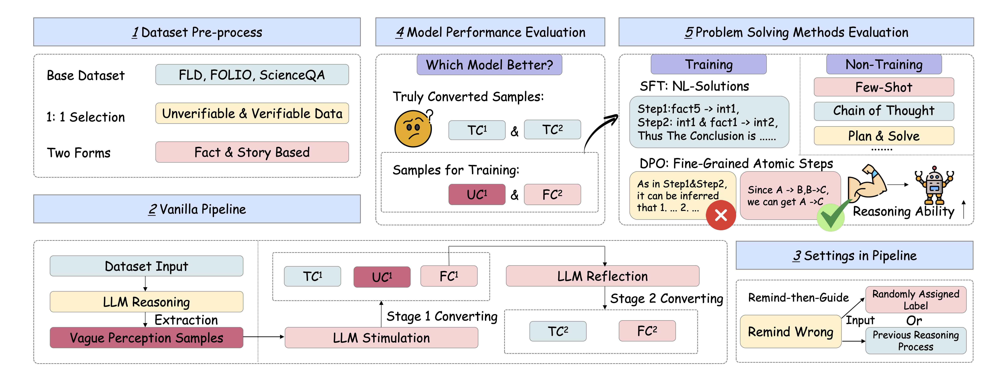

# WakenLLM Toolkit

[](https://opensource.org/licenses/MIT)

[](https://arxiv.org/abs/2507.16199)

This repository contains the official implementation for the arxiv preprint paper: **"WakenLLM: Evaluating Reasoning Potential and Stability in LLMs via Fine-Grained Benchmarking"**.

This toolkit provides a modular and extensible framework to reproduce all experiments in the paper. It facilitates the identification of the "Vague Perception" phenomenon and the execution of the multi-stage stimulation and reflection pipelines.

## Framework Overview

The WakenLLM framework evaluates LLMs through a series of carefully designed pipelines. The diagram below illustrates the core workflow.



## 🌟 Features

* **Modular Architecture**: A clean, object-oriented design that separates concerns (data handling, model interaction, evaluation, etc.).
* **Configuration Driven**: Easily manage and run complex experiments by simply editing YAML configuration files.
* **Extensible**: Designed to be easily extended with new datasets, models, or experimental pipelines.
* **Reproducibility**: 
Implements the full end-to-end workflows for the following three settings:
    * **Vanilla Pipeline** (Stage 1 Stimulation & Stage 2 Reflection).
    * **Remind-then-Guide (RtG) Label Conformity** tests.
    * **Remind-then-Guide (RtG) Reasoning Process Conformity** tests.

## 🔧 Installation

1.  **Clone the repository:**
    ```bash
    git clone [https://github.com/WakenLLMTeam/WakenLLM-toolkit.git](https://github.com/WakenLLMTeam/WakenLLM-toolkit.git)
    cd WakenLLM-toolkit
    ```

2.  **Create and activate a virtual environment (recommended):**
    ```bash
    # This project requires Python 3.9 or higher.
    python -m venv .venv
    source .venv/bin/activate  # On Windows, use `.venv\Scripts\activate`
    ```

3.  **Install dependencies:**
    ```bash
    pip install -r requirements.txt
    ```

## ⚙️ Configuration

Before running any experiments, you need to configure your API keys and experiment parameters.

### 1. API Keys

This project requires API keys to access to LLMs.

1.  Copy the template file `secrets.template.yaml` to the project root directory, creating a new file named `secrets.yaml`:
    ```bash
    cp secrets.template.yaml secrets.yaml
    ```
2.  Open `secrets.yaml` and fill in your own API key and base URL.

### 2. Experiment Parameters

All experiment settings are controlled via YAML files in the `configs/` directory. You can modify the main `configs/experiment.yaml` file or create new ones for different runs.

Key parameters include:
* `model_name`: The name of the model you want to test (e.g., "gpt-4o").
* `dataset_name`: The dataset to use (`FLD`, `FOLIO`, `ScienceQA_phy_bio`, etc.).
* `run_tasks`: A list of experiments to run. Options are: `"vanilla"`, `"rtg_label"`, `"rtg_process"`.

## 🛠️ Usage with Makefile (Recommended)

For a streamlined and reproducible workflow, this toolkit includes a powerful `Makefile` that automates all common tasks.

**1. See all available commands:**
Simply type `make` in your terminal to see a list of all commands and options.
```bash
make
````

**2. Setup Environment and Data:**
This command will install all dependencies. The second command will download available datasets and provide instructions for those that require manual download.

```bash
make setup
make download-data
```

**3. Run Experiments:**
You can easily run any experiment on any dataset with a simple command. The `Makefile` handles the configuration changes for you.

  * **Run the Vanilla Pipeline on the default FLD dataset:**

    ```bash
    make run-vanilla
    ```

  * **Run all three pipelines on the FOLIO dataset using the `qwen2.5-7b-instruct` model:**

    ```bash
    make run-all DATASET="FOLIO" MODEL="qwen2.5-7b-instruct"
    ```

  * **Run an experiment on a small subset for quick debugging (e.g., first 50 samples of FOLIO):**

    ```bash
    # Step 1: Create the subset file (e.g., FOLIO_subset_50.json)
    python scripts/prepare_subset.py --dataset FOLIO --samples 50

    # Step 2: Run the desired task on this new subset
    make run-vanilla DATASET="FOLIO_subset_50"
    ```

**4. Generate Visualizations:**
After running one or more experiments, generate a CSV summary and charts. The script will automatically find all summary files in the `results` directory.

```bash
make visualize
```

**5. Clean Up:**
To remove all generated results, logs, and cache files, run:

```bash
make clean
```

## 🚀 Usage Examples
For a streamlined and reproducible workflow, this toolkit includes a powerful `Makefile` that automates all common tasks.


### Running an Experiment

To run an experiment, simply point the main script to your desired configuration file.

```bash
python main.py --config configs/experiment.yaml
```

Below are examples of how to set up `configs/experiment.yaml` for each primary task.

#### Example 1: Vanilla Pipeline

To run the Stage 1 Stimulation and Stage 2 Reflection on the `FLD` dataset:

```yaml
# In configs/experiment.yaml
model_name: "gpt-3.5-turbo-1106"
dataset_name: "FLD"
run_tasks:
  - "vanilla"
```

#### Example 2: RtG Label Conformity

To test Remind-then-Guide Label Conformity on the `FOLIO` dataset:

```yaml
# In configs/experiment.yaml
model_name: "gpt-4o"
dataset_name: "FOLIO"
run_tasks:
  - "rtg_label"
```

#### Example 3: Running Multiple Tasks

You can run multiple experiments sequentially in a single command by listing them under `run_tasks`:

```yaml
# In configs/experiment.yaml
model_name: "llama-3.1-8b-instruct"
dataset_name: "ScienceQA_phy_bio"
run_tasks:
  - "vanilla"
  - "rtg_label"
  - "rtg_process"
```

## 📊 Understanding the Results

After running an experiment, all outputs will be saved in a timestamped subdirectory inside the `results/` folder (e.g., `results/2025-08-01_14-30-00/`).

Inside this directory, you will find:
* **`raw_outputs.jsonl`**: The detailed, turn-by-turn responses from the LLM for each sample.
* **`eval_summary.json`**: A summary file containing the final calculated metrics, such as Accuracy, Vague Perception Rate (VPR), and Conformity Scores.
* **`config_snapshot.yaml`**: A copy of the configuration file used for this run, ensuring full reproducibility.

## 📚 Data Preparation

The toolkit expects the raw dataset files to be placed in the `data/` directory. Please download the datasets from their original sources and place them accordingly.

* [**FLD**](https://github.com/hitachi-nlp/FLD): A benchmark dataset for evaluating logical reasoning and faithfulness in natural language processing tasks, focusing on fine-grained logical deduction and verification.

* [**ScienceQA**](https://github.com/lupantech/ScienceQA): A large-scale, multi-modal dataset for science question answering. In this work, we only select the pure language samples.
* [**FOLIO**](https://github.com/Yifan-Song793/FOLIO): A benchmark for evaluating faithfulness in logical reasoning over text.

Ensure the downloaded files are named to match the `dataset_name` used in the configuration (e.g., `data/FOLIO.json`).

## 🏛️ Project Structure

```
.
├── configs/            # Experiment configuration files (YAML)
├── data/               # Raw dataset files (user-provided)
├── results/            # All generated outputs and evaluation results
├── src/                # All source code
│   ├── config_loader.py  # Loads configuration
│   ├── data_handler.py   # Handles all file I/O
│   ├── evaluator.py      # Calculates all metrics
│   ├── llm_handler.py    # Manages all LLM API interactions
│   └── pipeline.py       # The core experimental workflow
├── main.py             # Main entry point of the toolkit
├── requirements.txt    # Project dependencies
├── README.md           # This file
└── LICENSE             # MIT License
```

## 🙏 Acknowledgements

We thank the creators of the datasets used in our study. This work also benefited from open-source libraries such as PyTorch and Hugging Face Transformers. We sincerely thank Hong Kong University of Science and Technology(Guangzhou), University of Pennsylvania, Huazhong University of Science and Technology, Nanjing University of Posts and Telecommunications and Hong Kong Polytechnic University for providing a supportive academic environment and the necessary resources to carry out this research.

## 📜 Citation

If you use this toolkit or the WAKENLLM framework in your research, please cite our paper:

```bibtex
@article{ling2025wakenllm,
      journal={arXiv preprint arXiv:2507.16199},
      title={WakenLLM: Evaluating Reasoning Potential and Stability in LLMs via Fine-Grained Benchmarking}, 
      author={Zipeng Ling and Yuehao Tang and Shuliang Liu and Junqi Yang and Shenghong Fu and Chen Huang and Kejia Huang and Yao Wan and Zhichao Hou and Xuming Hu},
      year={2025},
      eprint={2507.16199},
      archivePrefix={arXiv},
      primaryClass={cs.CL},
      url={https://arxiv.org/abs/2507.16199},     
}
```

## 📄 License
This project is licensed under the MIT License. See the [LICENSE](LICENSE) file for details.